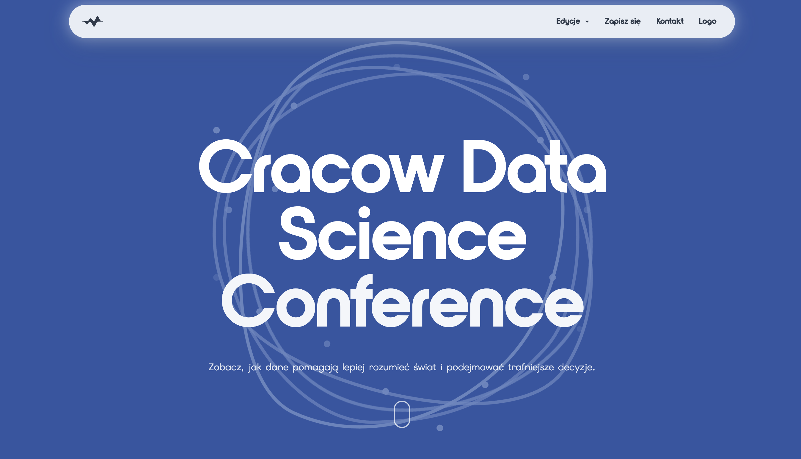
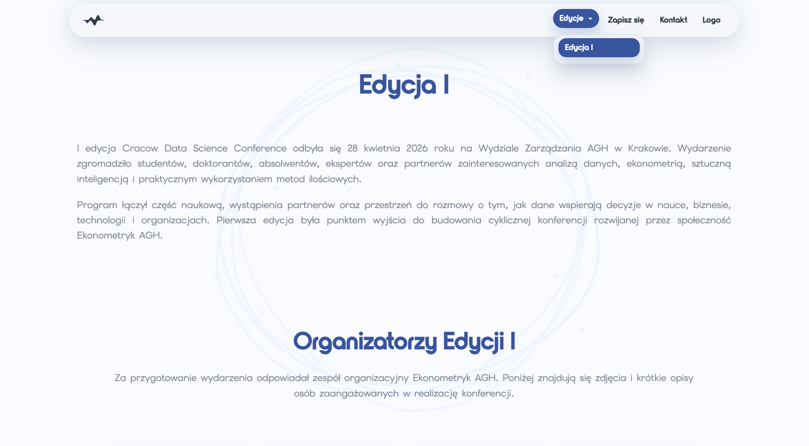

# Instrukcja użytkownika  
# Cracow Data Science Conference

## 1. Cel instrukcji

Ta instrukcja pokazuje, jak korzystać ze strony Cracow Data Science Conference oraz z panelu administratora. Jest napisana dla osoby, która nie musi znać programowania.

W projekcie są dwie części:

- publiczna strona konferencji,
- panel administratora uruchamiany lokalnie.

## 2. Wejście na publiczną stronę

Publiczna strona konferencji jest dostępna pod adresem:

`https://ciochdawid.github.io/Conference_projekt/`

Po wejściu na stronę użytkownik widzi stronę główną konferencji.



Na stronie można przejść do kilku podstron, między innymi:

- Edycje,
- Zapisz się,
- Kontakt,
- Logo,
- Regulamin.

## 3. Przeglądanie strony

### Strona główna

Na stronie głównej znajdują się podstawowe informacje o konferencji, jej tematyce i celu.

### Podstrona Edycja I

Podstrona Edycja I pokazuje informacje o poprzedniej edycji konferencji, organizatorach, partnerach i innych elementach związanych z wydarzeniem.



### Podstrona Kontakt

Na podstronie kontaktowej znajdują się dane kontaktowe oraz formularz kontaktowy.

### Podstrona Logo

Na tej podstronie znajdują się materiały graficzne związane z konferencją.

### Podstrona Regulamin

Na podstronie regulaminu można przeczytać zasady wydarzenia.

## 4. Uruchomienie panelu administracyjnego

Panel administratora działa lokalnie, więc najpierw trzeba uruchomić aplikację backendową.

W terminalu należy wejść do folderu projektu:

```bash
cd /Users/dawidcioch/Projects/Conference_projekt_backend
